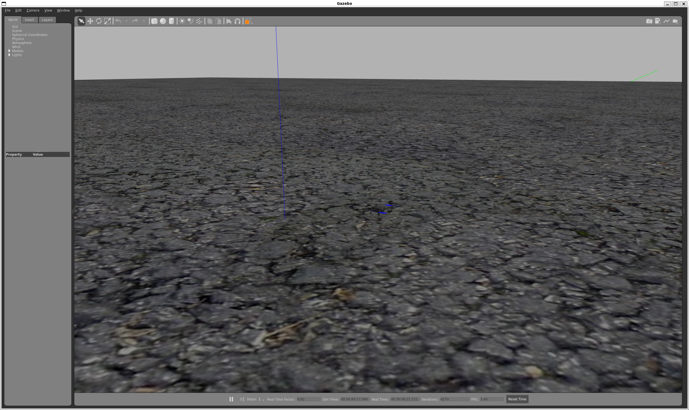
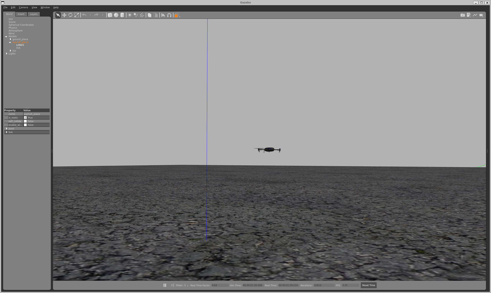

# PX4-SITL-Environment-Setup

드론제어 알고리즘을 하드웨어 없이 안전한 환경에서 테스트를 진행하기 위해서 환경을 구축하게 되었다.


<br>

## Tech Stack (사용 기술) 
- OS: windows11(WSL2 - Ubuntu22.04)
- Simulator: Gazebo Classic 11
- Firmware: PX4 Autopilot v1.14.0
- Language: Python 3.10 (예정)


## Key Features (구현 기능)
1. SITL 환경구축: 리눅스 환경에서 툴체인 및 빌드 환경 직접 구성
2. 자동 이착륙 제어: MAVLink 프로토콜을 이용한 Arming, Takeoff, Landing 시퀀스 구현
3. 상태 모니터링: 비동기 통신으로 드론의 연결 상태 실시간 확인


## Trouble Shooting (문제 해결 기록)
문제1: WSL2 실행 오류 (Error: 0x80370114)
- 현상: ubuntu 실행 시 가상화 관련 에러 발생하며 실행 불가
- 원인: Windows 기능 중 'Linux용 Windows 하위 시스템(Windows Subsystem for Linux)이 비활성화되어 발생
- 해결: Window 기능 켜기/끄기 설정에서 해당 기능 활성화 후 해결

문제2: 최신 PX4 버전과 Gazebo 버전 불일치
- 현상: make px4_still ...명령어 입력 시 타겟을 찾을 수 없다는 에러 발생
- 원인: main 브렌치의 업데이트로 Gazebo Classic 지원이 중단됨.
- 해결: 안정적인 학습을 위해 'git checkout v1.14.0'으로 버전을 고정하고 서브모듈을 재설정함.

문제3: Gazebo 실행 시 화면이 바로 꺼지는 문제 발생
- 현상: 시뮬레이터 창이 떴다가 즉시 꺼지는 현상 발생
- 원인: WSL2 환경에서의 그래픽 렌더링(GPU) 호환성 문제
- 해결: 'export LIBGL_AlWAYS_SOFTWARE=1' 환경변수를 설정하여 CPU 렌더링으로 전환하여 해결함.


## Installation Steps (구축 과정)

### 1. WSL2 Environment Setup
- Windows 기능 켜기/끄기를 통해 'Windows Subsystem for Linux' 및 'Virtual Machine Platform' 활성화
- Microsoft Store를 통해 Ubuntu 22.04 LTS 설치

### 2. PX4 Source Code Setup (Version v1.14)
최신 main 브랜치의 불안정성과 Gazebo Classic 지원 중단 이슈를 해결하기 위해, 안정적인 v1.14.0 버전으로 환경을 구축함.
```bash
git clone [http://github.com/PX4/PX4-Autopilot.git](http://github.com/PX4/PX4-Autopilot.git) --recursive
cd PX4-Autopilot
git checkout v1.14.0
git submodule update --init --recursive --force
```

### 3. Dependencies Installation
- ubuntu.sh 스크립트를 활용하여 툴체인 자동 설치
- Gazebo Classic 수동 설치 및 필수 Python 패키지 의존성 해결


## Result (결과)
```bash
make px4_sitl gazebo
```

```bash
command takeoff
```


